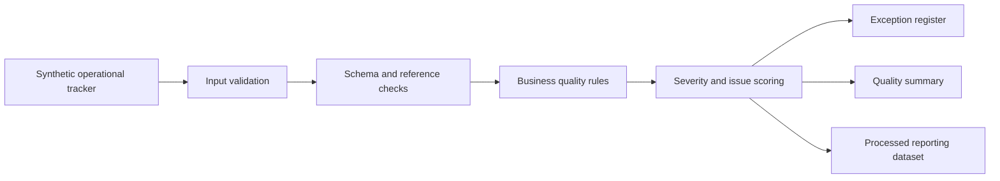

# Operational Data Quality Engine

[](https://github.com/quantameridian/operational-data-quality-engine/actions/workflows/ci.yml)
[](https://github.com/quantameridian/operational-data-quality-engine/actions/workflows/codeql.yml)
[](https://scorecard.dev/viewer/?uri=github.com/quantameridian/operational-data-quality-engine)
[](LICENSE)

## Project purpose

This repository builds a Python-based data quality engine for checking operational tracker data before it is used in management reporting, assurance review, or performance discussion.

The engine is intended to take a realistic sample operational tracker, apply defined quality rules, and produce clear exceptions that show which records need attention before the data can be trusted for reporting.

## Reviewer quick path

If you are reviewing this quickly, start here:

1. Read the business problem and rule table below.
2. Inspect the generated outputs in `outputs/exception_register.csv`, `outputs/quality_summary.md`, and `docs/exception-register-preview.md`.
3. Run `make qa` to lint, test, regenerate the sample outputs, and refresh the markdown preview.

The current GitHub Actions workflow runs linting, tests, and the sample engine execution on every push to `main`.

## Business problem

Teams often rely on manually maintained trackers for operational reporting. These trackers may hold open actions, risk items, assurance findings, service issues, or review records. The data may be good enough for day-to-day handling but weak for reporting because ownership, review dates, evidence, statuses, and closure details are not consistently maintained.

Typical issues include:

- records without a named owner;
- duplicate record identifiers;
- invalid or inconsistent status values;
- overdue reviews;
- stale open records;
- high-risk items without a clear action owner;
- closed items without closure evidence.

If these issues are not found early, dashboards and management packs can give a false sense of control. This project treats data quality as a reporting-readiness check rather than an afterthought.

## What this project demonstrates

- Python analytical development with a small package structure.
- Data quality rule design in business-readable language.
- Exception management and severity assignment.
- Reporting-readiness assessment before dashboard use.
- Assurance and control thinking around operational records.
- Reproducible outputs from synthetic sample data.
- Testable business logic for rules that matter in reporting.

## Architecture

Implemented flow:



The current implementation uses CSV input, small standard-library Python modules, rule functions that are easy to test, and reproducible outputs written to `outputs/`.

Package shape:

- `ingest.py`: load and prepare input files.
- `schema.py`: define expected fields and reference values.
- `rules.py`: apply data quality checks.
- `scoring.py`: assign severity and reporting-readiness scores.
- `reporting.py`: create output tables and summary views.
- `cli.py`: provide a simple local run command.

## Sample data

The repo now includes a synthetic operational tracker at:

`data/raw/operational_tracker_sample.csv`

The sample data is generic and non-client. It is designed to represent the kinds of reporting quality issues that can appear in manually maintained trackers.

Current fields:

| Field | Purpose |
| --- | --- |
| `record_id` | Unique identifier for the tracker row |
| `service_area` | Broad service area responsible for or affected by the record |
| `reporting_unit` | Reporting grouping for management review |
| `owner_name` | Owner recorded against the tracker row |
| `owner_email` | Generic sample email address using `example.com` |
| `review_cycle` | Expected review frequency |
| `status` | Current lifecycle state |
| `risk_rating` | Reporting risk or priority |
| `evidence_link` | Reference to review or supporting evidence |
| `last_reviewed_date` | Date of most recent review |
| `next_review_due` | Date the next review is due |
| `action_owner` | Person or role responsible for next action |
| `action_due_date` | Due date for the next action |
| `issue_category` | Generic issue grouping |
| `closure_evidence` | Evidence reference supporting closure |
| `notes` | Short sample-data note |

See [docs/data-dictionary.md](docs/data-dictionary.md) for field definitions, approved values, and deliberate quality scenarios.

## Data quality rules

The implemented rules cover core ownership, status, duplicate, evidence, review-cycle, stale-record, and overdue-action checks. Additional planned rules are documented in [docs/data-quality-rules.md](docs/data-quality-rules.md).

| Rule ID | Rule name | Severity | Summary |
| --- | --- | --- | --- |
| DQ001 | Missing owner details | High | Records should have owner name and owner email for follow-up |
| DQ002 | Invalid status | High | Status must match the approved status list |
| DQ003 | Missing action owner | High | Unresolved records should have an accountable action owner |
| DQ004 | Duplicate record | High | `record_id` should be unique |
| DQ005 | Overdue review | Medium | Unresolved records should be reviewed before the review due date passes |
| DQ006 | Stale record | Medium | Unresolved records should not go more than two expected cycles without review |
| DQ007 | Invalid review cycle | Medium | Next review due date should fall after the last reviewed date |
| DQ009 | Closed item missing closure evidence | High | Closed records should have closure date and supporting evidence |
| DQ010 | Overdue action | High | Unresolved records should not have a missed action due date without review or escalation |

## How to run locally

A reviewer can install the project, run checks, and regenerate outputs with `make`.
Use Python 3.11 or newer; the CI security checks run on Python 3.11.

```bash
make install
make qa
```

`make run` reads:

`data/raw/operational_tracker_sample.csv`

and writes:

- `outputs/exception_register.csv`
- `outputs/quality_summary.md`
- `docs/exception-register-preview.md`

The same output generation can be run directly with the CLI:

```bash
python -m quality_engine.cli \
  --input data/raw/operational_tracker_sample.csv \
  --output-dir outputs \
  --report-date 2026-06-19
```

After installation, the console script is also available:

```bash
quality-engine --input data/raw/operational_tracker_sample.csv --output-dir outputs
```

## Outputs

Current generated output:

- `outputs/exception_register.csv`: one row per failed rule, including record ID, rule ID, severity, issue description, and recommended action.
- `outputs/quality_summary.md`: a markdown summary with a simple reporting-readiness score and the inputs used to calculate it.
- `docs/exception-register-preview.md`: a generated high-severity-first markdown preview for fast GitHub review.

Potential later output:

- `outputs/quality_summary.html`: management-readable summary of issue counts, severity profile, and reporting-readiness status.

The current outputs are generated from `data/raw/operational_tracker_sample.csv` using the implemented core rules. They are not hand-written.

## Scoring model

The readiness score starts at 100 and applies capped penalties for:

- exception rate relative to record count;
- severity mix in the validation issues;
- high-risk unresolved records with current exceptions or no action owner;
- missing evidence indicators;
- overdue review indicators.

The score is intentionally simple. It is a reporting-readiness signal, not a statistical model and not a proof that the operational facts are correct.

## Tests and quality checks

Current checks:

- `make test`: runs pytest coverage for schema validation, rules, reporting, scoring, and CLI output generation.
- `make lint`: runs Ruff against the repository.
- `make audit`: runs a Python dependency vulnerability audit.
- `make run`: regenerates the exception register and quality summary from the synthetic sample data.
- `make preview`: regenerates the reviewer-facing markdown exception preview from the CSV output.
- `make qa`: runs linting, tests, sample output generation, and preview generation in one command.

Security posture and public-data boundaries are documented in [docs/security-posture.md](docs/security-posture.md).

## How this applies commercially

In a real organisation, a similar engine could be used before weekly or monthly reporting to identify records that weaken confidence in the pack. It would not replace judgement, but it would give analysts, report owners, and managers a repeatable way to see whether the source tracker is ready for reporting.

The pattern is relevant to:

- operational assurance trackers;
- service reporting datasets;
- risk and issue logs;
- action registers;
- data quality gates before dashboard refresh;
- reporting handover and control routines.

## Limitations

- This is a portfolio project using synthetic data.
- It does not represent delivery for any named organisation.
- The first implementation will use batch file processing rather than system integration.
- Rule thresholds will be illustrative and should be reviewed before use in a real setting.
- The engine will identify likely reporting issues; it will not decide operational action by itself.

## Next implementation layers

1. Add explicit row-level rules for missing review evidence if useful.
2. Consider adding an HTML summary output if useful for reviewer presentation.
3. Add coverage reporting if the project expands beyond the current small rule engine.
4. Add a lightweight release checklist once the repo has more than one public version.
