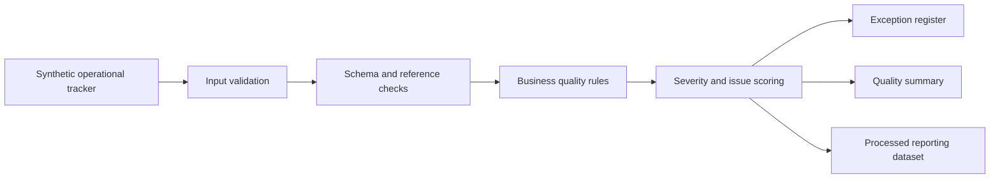

# Operational Data Quality Engine

[](https://github.com/quantameridian/operational-data-quality-engine/actions/workflows/ci.yml)
[](https://github.com/quantameridian/operational-data-quality-engine/actions/workflows/codeql.yml)
[](https://scorecard.dev/viewer/?uri=github.com/quantameridian/operational-data-quality-engine)
[](LICENSE)

## Project purpose

This repository is a public portfolio example of a Python data quality engine. It checks an operational tracker before the data is used in a management report, assurance review, or performance discussion.

The engine reads a realistic sample tracker, applies clear quality rules, and writes out the records that need attention. The point is simple: before anyone trusts a report, someone should know which source records are incomplete, stale, duplicated, or missing evidence.

## Portfolio focus

This repo is designed to show how I approach data quality work in a business setting. It is not a demo that stops at checking for empty fields. It shows how I turn a reporting risk into tested rules, useful exception output, a clear contract, and a run path that another reviewer can repeat.

A hiring or technical reviewer should be able to follow the whole route: source data comes in, business rules are applied, failed checks are written as useful exceptions, and the final summary says whether the tracker is ready for reporting. The code is small enough to inspect, but it still shows the habits that matter in commercial work: clear rule design, repeatable output, tests, a data contract, CI, dependency audit, CodeQL, and safe synthetic data.

What this does not claim: this is not a live enterprise data quality platform. There is no scheduler, database adapter, alerting layer, or production access model yet. The value of the repo is the engineering shape and the judgement behind it.

## Reviewer quick path

If you only have a few minutes, start here:

1. Read [docs/reviewer-guide.md](docs/reviewer-guide.md).
2. Read the business problem and rule table below.
3. Inspect the contract in `contracts/operational-tracker-contract.json`.
4. Inspect the generated outputs in `outputs/exception_register.csv`, `outputs/quality_summary.md`, and `docs/exception-register-preview.md`.
5. Read [docs/operational-runbook.md](docs/operational-runbook.md) for how a reporting team would use the results.
6. Run `make qa` to lint, test, regenerate the sample outputs, and refresh the markdown preview.

The current GitHub Actions workflow runs linting, tests, and the sample engine execution on every push to `main`.

## Business problem

Many reporting processes still rely on manual trackers. Those trackers may hold open actions, risk items, assurance findings, service issues, or review records. They can work well enough for daily handling, but still be weak evidence for a report because ownership, review dates, evidence, statuses, and closure details are not maintained with the same care.

Typical issues include:

- records without a named owner;
- duplicate record identifiers;
- invalid or inconsistent status values;
- overdue reviews;
- stale open records;
- high risk items without a clear action owner;
- closed items without closure evidence.

If these issues are found late, the report can look tidy while the source data is still shaky. This project treats data quality as a check that happens before reporting, not after the meeting has already started.

## What this project shows

- Python work with a small package structure.
- Data quality rules written in business language.
- Exception management and severity assignment.
- Readiness checks before dashboard use.
- Assurance and control thinking around operational records.
- Reproducible outputs from synthetic sample data.
- Testable business logic for rules that matter in reporting.

## Skills demonstrated

| Skill | Where to inspect |
| --- | --- |
| Python package structure | `src/quality_engine` modules and CLI entry point |
| Data quality rule design | `src/quality_engine/rules.py` and [docs/data-quality-rules.md](docs/data-quality-rules.md) |
| Data contract discipline | `contracts/operational-tracker-contract.json` and `tests/test_contract.py` |
| Tested business logic | `tests/` coverage for schema, rules, scoring, reporting, and CLI behavior |
| Reporting output design | `outputs/exception_register.csv`, `outputs/quality_summary.md`, and [docs/exception-register-preview.md](docs/exception-register-preview.md) |
| Operational response model | [docs/operational-runbook.md](docs/operational-runbook.md) |
| Public repo security practice | [docs/security-posture.md](docs/security-posture.md), CI, CodeQL, Scorecard, and dependency audit |

## Architecture

Implemented flow:


```mermaid
flowchart LR
    A["Synthetic operational tracker"] --> B["Input validation"]
    B --> C["Schema and reference checks"]
    C --> D["Business quality rules"]
    D --> E["Severity and issue scoring"]
    E --> F["Exception register"]
    E --> G["Quality summary"]
    E --> H["Processed reporting dataset"]
```

The current implementation uses CSV input, small Python modules from the standard library, rule functions that are easy to test, and reproducible outputs written to `outputs/`.

Package shape:

- `ingest.py`: load and prepare input files.
- `schema.py`: define expected fields and reference values.
- `rules.py`: apply data quality checks.
- `scoring.py`: assign severity and readiness scores.
- `reporting.py`: create output tables and summary views.
- `cli.py`: provide a simple local run command.

## Sample data

The repo now includes a synthetic operational tracker at:

`data/raw/operational_tracker_sample.csv`

The sample data is synthetic. It shows the kinds of quality issues that often appear in manual trackers, without using data from any client, employer, or real organisation.

Current fields:

| Field | Purpose |
| --- | --- |
| `record_id` | Unique identifier for the tracker row |
| `service_area` | Broad service area responsible for or affected by the record |
| `reporting_unit` | Reporting grouping for management review |
| `owner_name` | Owner recorded against the tracker row |
| `owner_email` | Generic sample email address using `example.com` |
| `review_cycle` | Expected review frequency |
| `status` | Current lifecycle state |
| `risk_rating` | Reporting risk or priority |
| `evidence_link` | Reference to review or supporting evidence |
| `last_reviewed_date` | Date of most recent review |
| `next_review_due` | Date the next review is due |
| `action_owner` | Person or role responsible for next action |
| `action_due_date` | Due date for the next action |
| `issue_category` | Generic issue grouping |
| `closure_evidence` | Evidence reference supporting closure |
| `notes` | Short sample note |

See [docs/data-dictionary.md](docs/data-dictionary.md) for field definitions, approved values, and deliberate quality scenarios.

## Data quality rules

The implemented rules cover ownership, status, duplicate records, evidence, review timing, stale records, and overdue actions. Additional planned rules are documented in [docs/data-quality-rules.md](docs/data-quality-rules.md).

| Rule ID | Rule name | Severity | Summary |
| --- | --- | --- | --- |
| DQ001 | Missing owner details | High | Records should have owner name and owner email for follow up |
| DQ002 | Invalid status | High | Status must match the approved status list |
| DQ003 | Missing action owner | High | Unresolved records should have an accountable action owner |
| DQ004 | Duplicate record | High | `record_id` should be unique |
| DQ005 | Overdue review | Medium | Unresolved records should be reviewed before the review due date passes |
| DQ006 | Stale record | Medium | Unresolved records should not go more than two expected cycles without review |
| DQ007 | Invalid review cycle | Medium | Next review due date should fall after the last reviewed date |
| DQ009 | Closed item missing closure evidence | High | Closed records should have closure date and supporting evidence |
| DQ010 | Overdue action | High | Unresolved records should not have a missed action due date without review or escalation |

## How to run locally

A reviewer can install the project, run checks, and regenerate outputs with `make`.
Use Python 3.11 or newer; the CI security checks run on Python 3.11.

```bash
make install
make qa
```

`make run` reads:

`data/raw/operational_tracker_sample.csv`

and writes:

- `outputs/exception_register.csv`
- `outputs/quality_summary.md`
- `docs/exception-register-preview.md`

The same output generation can be run directly with the CLI:

```bash
python -m quality_engine.cli \
  --input data/raw/operational_tracker_sample.csv \
  --output-dir outputs \
  --report-date 2026-06-19
```

After installation, the console script is also available:

```bash
quality-engine --input data/raw/operational_tracker_sample.csv --output-dir outputs
```

## Outputs

Current generated output:

- `outputs/exception_register.csv`: one row per failed rule, including record ID, rule ID, severity, issue description, and recommended action.
- `outputs/quality_summary.md`: a markdown summary with a simple readiness score and the inputs used to calculate it.
- `docs/exception-register-preview.md`: a generated markdown preview that puts high severity issues first.

Potential later output:

- `outputs/quality_summary.html`: a management summary of issue counts, severity profile, and readiness status.

The current outputs are generated from `data/raw/operational_tracker_sample.csv` using the implemented rules. They are not written by hand.

## Scoring model

The readiness score starts at 100 and applies capped penalties for:

- exception rate relative to record count;
- severity mix in the validation issues;
- high risk unresolved records with current exceptions or no action owner;
- missing evidence indicators;
- overdue review indicators.

The score is intentionally simple. It is a readiness signal, not a statistical model and not proof that the operational facts are correct.

## Tests and quality checks

Current checks:

- `make test`: runs pytest coverage for schema validation, rules, reporting, scoring, and CLI output generation.
- `make lint`: runs Ruff against the repository.
- `make audit`: runs a Python dependency vulnerability audit.
- `make run`: regenerates the exception register and quality summary from the synthetic sample data.
- `make preview`: regenerates the markdown exception preview from the CSV output.
- `make qa`: runs linting, tests, sample output generation, and preview generation in one command.

Security posture and public data boundaries are documented in [docs/security-posture.md](docs/security-posture.md).

## Where this fits

In a real organisation, a similar engine could run before a weekly or monthly report is sent out. It would not replace judgement. It would give analysts, report owners, and managers a repeatable way to see whether the source tracker is ready to use.

For portfolio review, this repo is strongest as evidence of Python data quality engineering, test design, exception output, and practical reporting control thinking.

The pattern is relevant to:

- operational assurance trackers;
- service reporting datasets;
- risk and issue logs;
- action registers;
- data quality gates before dashboard refresh;
- reporting handover and control routines.

## Limitations

- This is a portfolio project using synthetic data.
- It does not represent delivery for any named organisation.
- The first implementation will use batch file processing rather than system integration.
- Rule thresholds will be illustrative and should be reviewed before use in a real setting.
- The engine will identify likely reporting issues; it will not decide operational action by itself.

## Next implementation layers

1. Add explicit row rules for missing review evidence if useful.
2. Consider adding an HTML summary output if useful for reviewer presentation.
3. Add coverage reporting if the project expands beyond the current small rule engine.
4. Add a lightweight release checklist once the repo has more than one public version.
