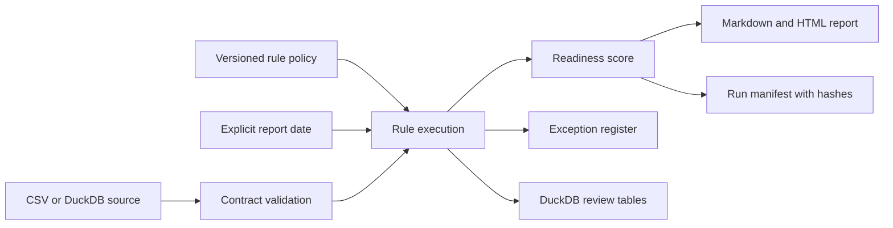

# Operational Data Quality Engine

[](https://github.com/quantameridian/operational-data-quality-engine/actions/workflows/ci.yml)
[](https://github.com/quantameridian/operational-data-quality-engine/actions/workflows/codeql.yml)
[](https://scorecard.dev/viewer/?uri=github.com/quantameridian/operational-data-quality-engine)
[](LICENSE)

A Python quality gate for operational records. It tells a reporting owner whether a tracker is reliable enough to use in a management pack, which records need correction, and why the decision was made.

The worked case is a monthly service review on 19 June 2026. The input contains open actions, risks, reviews, and closure evidence. Some records are deliberately incomplete or inconsistent. Every name, email address, and record is synthetic.

## See the result

The supplied blocked scenario produces:

| Measure | Result |
| --- | ---: |
| Records checked | 30 |
| Exceptions | 39 |
| High severity exceptions | 16 |
| Readiness score | 12 / 100 |
| Decision | Not ready for reporting |

Open the [HTML quality report](outputs/quality_report.html), [quality summary](outputs/quality_summary.md), or [exception preview](docs/exception-register-preview.md). The [run manifest](outputs/run_manifest.json) records the engine version, rule policy version, report date, input hash, configuration hash, result, and output hashes.

Three tested datasets show the decision range:

| Scenario | Score | Decision |
| --- | ---: | --- |
| [Clean](data/scenarios/tracker_clean.csv) | 100 | Ready for routine reporting |
| [Review](data/scenarios/tracker_review.csv) | 82 | Usable with review |
| [Blocked](data/raw/operational_tracker_sample.csv) | 12 | Not ready for reporting |

## Run it

Use Python 3.11 or newer.

```bash
make install
make qa
make audit
make benchmark
```

`make qa` runs Ruff, more than 40 tests with a 90 per cent coverage gate, the sample quality run, and the exception preview. The run also writes a local DuckDB database. That database is ignored by Git because it is a generated binary.

The command line interface accepts CSV or DuckDB input:

```bash
quality-engine \
  --input data/raw/operational_tracker_sample.csv \
  --output-dir outputs \
  --report-date 2026-06-19 \
  --rules-config config/default-rules.yml \
  --run-id monthly-service-review \
  --write-duckdb
```

Use `--log-format json` for machine readable events. Use `--fail-below-score 70` to return exit code `2` when the dataset does not meet a pipeline threshold. Invalid input or configuration returns exit code `1`.

## Decision flow


```mermaid
flowchart LR
    A["CSV or DuckDB source"] --> B["Contract validation"]
    C["Versioned rule policy"] --> D["Rule execution"]
    E["Explicit report date"] --> D
    B --> D
    D --> F["Readiness score"]
    D --> G["Exception register"]
    F --> H["Markdown and HTML report"]
    F --> I["Run manifest with hashes"]
    D --> J["DuckDB review tables"]
```

The engine flags source records. It does not silently repair them. The reporting owner can trace every exception back to a rule, field, record, severity, and recommended action.

## Rules

Rules and severities live in the [default rule file](config/default-rules.yml). The JSON [data contract](contracts/operational-tracker-contract.json) is checked against the Python schema and output contract in the test suite.

| Rule | Failure found |
| --- | --- |
| DQ001 | Owner name or email is missing |
| DQ002 | Status is outside the approved values |
| DQ003 | An unresolved item has no action owner |
| DQ004 | A record identifier appears more than once |
| DQ005 | An unresolved review is overdue |
| DQ006 | A record has missed the configured number of review cycles |
| DQ007 | The next review date is not after the last review |
| DQ008 | Review evidence is missing |
| DQ009 | A completed item has no closure evidence |
| DQ010 | An unresolved action is overdue |
| DQ011 | Risk rating is outside the approved values |
| DQ012 | Review cycle is outside the approved values |
| DQ013 | A nonblank date is not a valid ISO calendar date |

## Engineering evidence

| Capability | Evidence in this repository |
| --- | --- |
| Python design | Separate modules for configuration, context, ingestion, rules, scoring, reporting, and storage |
| Data contracts | Versioned JSON contract, approved values, schema tests, and clear failures for missing fields |
| Configurable controls | Versioned YAML policy with rule switches, severity overrides, staleness, and readiness thresholds |
| Integration | Equivalent CSV and DuckDB input paths plus a DuckDB run output with source, exception, summary, and lineage tables |
| Reproducibility | Explicit report date, stable run identifier, SHA256 lineage, deterministic text outputs, and generated file hashes |
| Test design | Unit, integration, scenario, contract, database, failure path, and command line tests with 96 per cent current coverage |
| Scale evidence | A deterministic 100,000 row benchmark and a 10,000 row CI smoke run |
| Delivery controls | Read only workflow permissions, pinned actions, dependency audit, CodeQL, Scorecard, Dependabot, and synthetic data boundaries |

The [reviewer guide](docs/reviewer-guide.md) gives a ten minute route through the evidence. [Engineering decisions](docs/engineering-decisions.md) records tradeoffs. [Industry alignment](docs/industry-alignment.md) maps the implementation to current public engineering guidance without claiming certification.

## Boundaries

This is a local batch engine, not a hosted service. It has no scheduler, identity layer, alert transport, or live source connector. A production deployment would need ownership, access control, encrypted storage, secrets management, monitoring, retention, recovery, and a rule approval process suited to the organisation.

The score is an explainable gate, not proof that the source facts are true. A record can pass every implemented rule and still be wrong. See [limitations](docs/limitations.md) and the [security posture](docs/security-posture.md).
