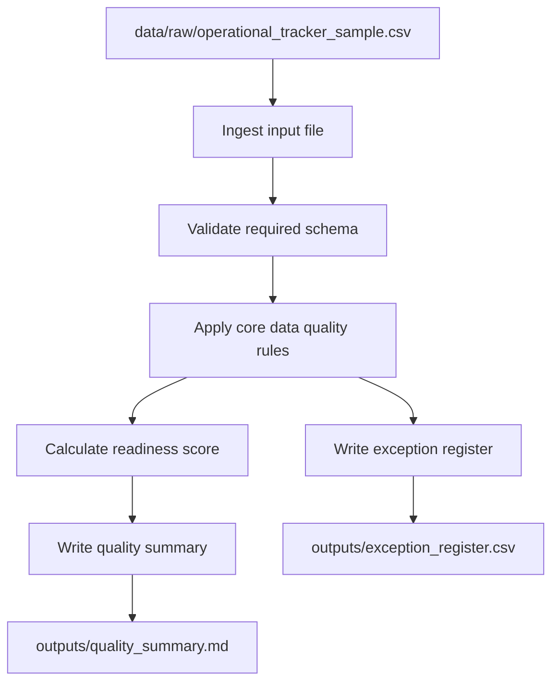

# Architecture

## Purpose

This document defines the current architecture for the operational data quality engine.

The design is intentionally small: a local Python package that reads synthetic operational tracker data, validates the structure, applies business-facing data quality rules, scores the results, and writes reproducible reporting outputs.

## Commercial scenario

A team maintains an operational tracker that feeds a management pack or assurance review. The tracker is manually updated and contains records such as actions, findings, service issues, or risk items. Before the data is used for reporting, the team needs to know whether the records are complete, current, owned, evidenced, and internally consistent.

The engine should provide a repeatable check at that point in the reporting cycle.

## Current data flow

## Planned repository boundaries

This repo should focus on the data quality engine only. It should not become a dashboard project, a dbt mart, or a general documentation playbook.

In the wider portfolio:

- this repo checks whether operational records are fit for reporting;
- the analytics engineering repo should model reporting data;
- the Power BI repo should document KPI and semantic-model design;
- the architecture playbook should describe operating model and handover patterns.

## Intended components

| Component | Responsibility |
| --- | --- |
| `ingest.py` | Load CSV input and validate required headers |
| `schema.py` | Define required columns and approved status values |
| `rules.py` | Apply business-readable data quality checks |
| `scoring.py` | Assign severity and support reporting-readiness scoring |
| `reporting.py` | Produce exception and summary outputs |
| `cli.py` | Provide a reviewer-friendly local command |

## Planned processing stages

1. Load the synthetic tracker data.
2. Validate required fields.
3. Apply each rule independently so failures can be tested and explained.
4. Combine failures into a single exception register.
5. Add severity and recommended action.
6. Produce summary outputs for review.

## Output design principles

- Exception outputs should identify the specific record and rule that failed.
- Summary outputs should be understandable without reading the code.
- Generated files should be reproducible from the sample data.
- The engine should flag quality issues rather than silently changing source records.

## Design principle

Keep the first version small enough for a reviewer to understand quickly, while still showing production habits: clear module boundaries, tests, documented assumptions, and reproducible outputs.
