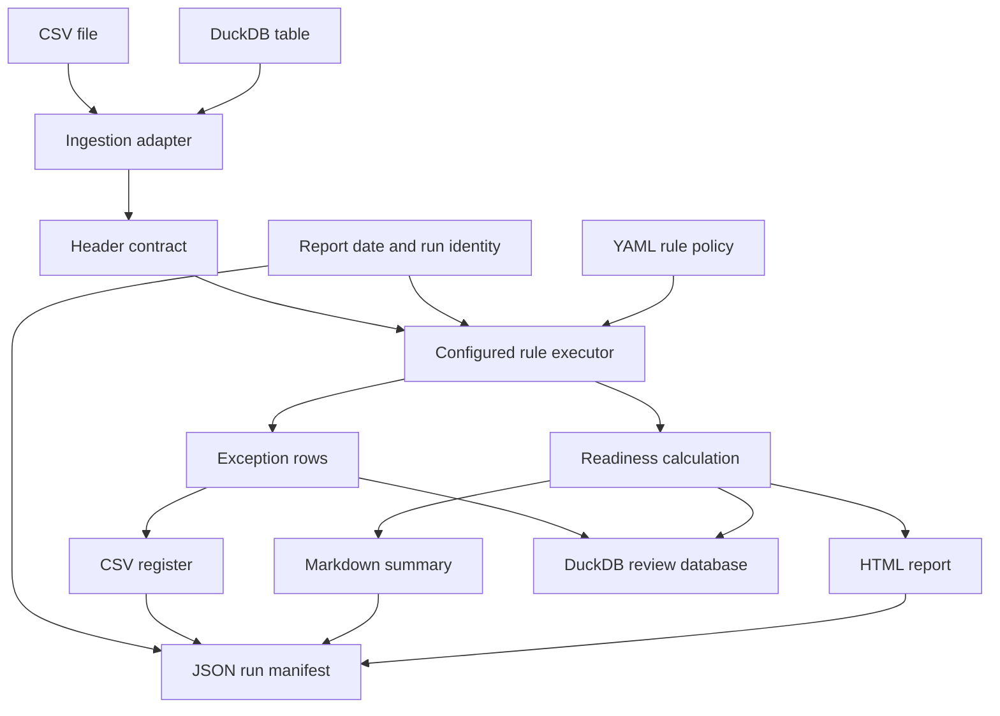

# Architecture

## Context

A reporting owner receives an operational tracker before a monthly service review. The tracker is easy to edit but difficult to trust. Ownership can be blank, identifiers can be duplicated, dates can be stale, and a closed item can lack evidence.

This engine sits between source receipt and report production. It gives the owner a repeatable decision and a register of corrections. It never changes the source record.

## Components

```mermaid
flowchart TD
    A["CSV file"] --> C["Ingestion adapter"]
    B["DuckDB table"] --> C
    C --> D["Header contract"]
    D --> E["Configured rule executor"]
    F["Report date and run identity"] --> E
    G["YAML rule policy"] --> E
    E --> H["Exception rows"]
    E --> I["Readiness calculation"]
    H --> J["CSV register"]
    I --> K["Markdown summary"]
    I --> L["HTML report"]
    H --> M["DuckDB review database"]
    I --> M
    F --> N["JSON run manifest"]
    J --> N
    K --> N
    L --> N
```

| Module | Responsibility |
| --- | --- |
| `config.py` | Validate the versioned rule and readiness policy |
| `context.py` | Build stable run identity and SHA256 lineage |
| `ingest.py` | Read CSV or DuckDB input against one field contract |
| `schema.py` | Own required fields and approved values |
| `rules.py` | Return record level exceptions without changing source data |
| `scoring.py` | Calculate and explain the readiness result |
| `reporting.py` | Write CSV, Markdown, HTML, and manifest outputs |
| `storage.py` | Write source, exception, summary, and lineage tables to DuckDB |
| `cli.py` | Define the operational interface, event format, and exit codes |

## Runtime contract

The report date is mandatory because overdue and stale results depend on it. A run cannot silently inherit the date on which a developer happens to execute the command.

The rule policy is external to the code. A policy change therefore has its own version and hash. The manifest joins that policy identity to the input hash, engine version, decision, and output hashes.

| Exit code | Meaning |
| ---: | --- |
| 0 | The engine completed and any requested score gate passed |
| 1 | Input, schema, or configuration failed |
| 2 | The engine completed but the score was below `--fail-below-score` |

## Trust boundaries

The repository contains synthetic data and needs no network connection or secret for a normal run. CSV content and DuckDB tables are untrusted input. CSV is parsed by the standard library. DuckDB table names are restricted to letters, numbers, and underscores before they are used in SQL.

A production service would add identity, encrypted storage, managed secrets, source authentication, event monitoring, retention controls, recovery procedures, and an approved release process. Those controls are outside this local engine.
